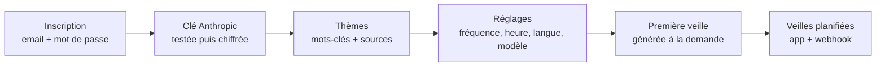
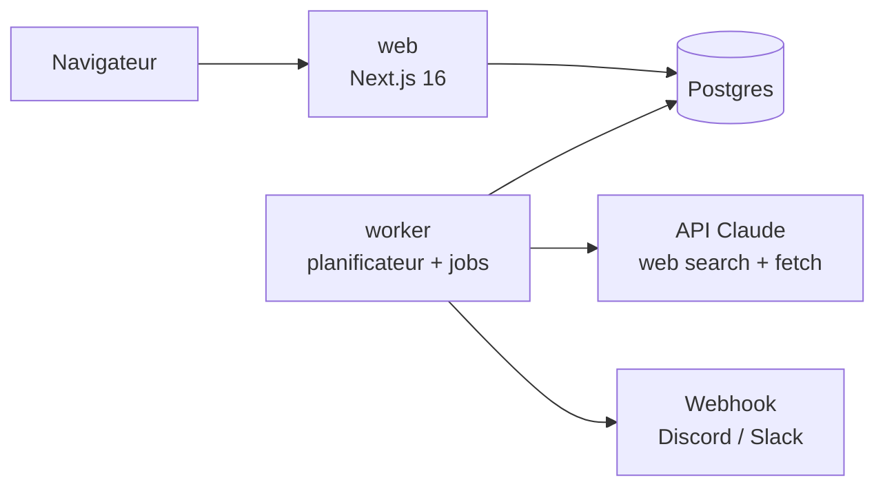
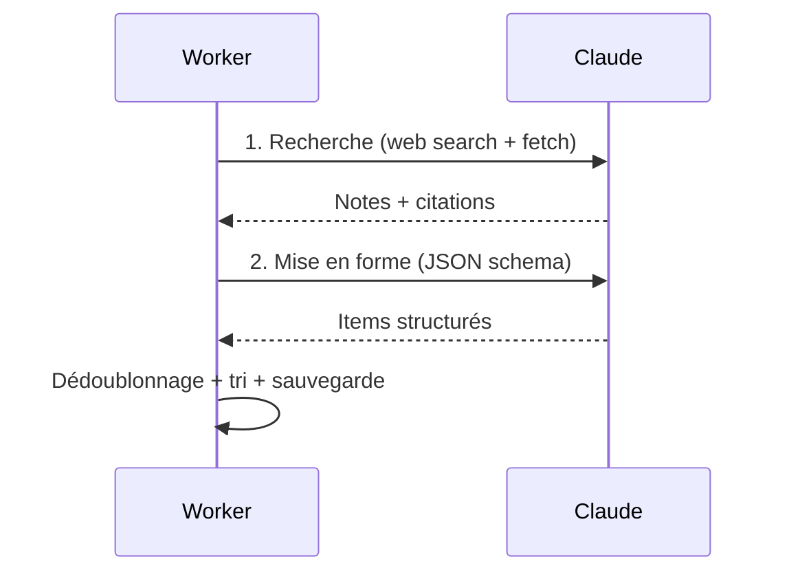

# Digest — cahier des charges

24 sept. 2026 · Gabin Hallosserie

## Vision et périmètre

Digest est une veille techno open source et auto-hébergeable. Chaque utilisateur choisit ses thèmes, branche sa propre clé Anthropic et reçoit chaque jour ou chaque semaine une synthèse sourcée, rédigée dans sa langue.

### Objectifs

- Remplacer la veille manuelle (newsletters, flux RSS, réseaux) par une synthèse courte, ciblée et vérifiable.
- Servir de projet portfolio : architecture propre, IA appliquée, déploiement Docker sur VPS.
- Coût d'IA nul pour l'hébergeur : chaque compte utilise sa propre clé API.

**Public** : développeurs et équipes tech qui suivent un petit nombre de sujets précis (framework, langage, secteur, concurrent).

### Dans le MVP

- Comptes email + mot de passe, clé Anthropic chiffrée, choix du modèle.
- Thèmes personnalisés, fréquence quotidienne ou hebdomadaire, langue de sortie.
- Génération planifiée avec recherche web, sources citées, dédoublonnage.
- Livraison dans l'app et par webhook Discord ou Slack.

**Hors MVP** : email, flux RSS privé, équipes et partage, application mobile, facturation.

## Parcours utilisateur

Un nouvel utilisateur reçoit sa première veille en moins de 5 minutes, sans attendre la prochaine exécution planifiée.

L'onboarding enchaîne ces étapes. Chacune reste modifiable ensuite dans les réglages.

1. **Inscription** : email, mot de passe, vérification de l'adresse par lien.
2. **Clé API** : collage de la clé, appel de test (coût négligeable), message clair si elle est invalide ou sans crédit. La clé n'est plus jamais réaffichée, seulement ses 4 derniers caractères.
3. **Thèmes** : titre, description libre (« Nouveautés Next.js et React Server Components »), mots-clés, sources à privilégier ou à exclure. Modèles proposés : IA, front-end, sécurité, DevOps.
4. **Réglages** : fréquence (quotidienne, ou hebdomadaire avec un jour), heure, fuseau, langue de sortie, modèle Claude, webhook Discord ou Slack.
5. **Première veille** : bouton « Générer maintenant », avec la progression affichée thème par thème.
6. **Lecture** : fil des veilles, chaque info dépliable avec son résumé, « pourquoi c'est important » et ses sources. Favoris, recherche, et note utile / pas utile qui affine les veilles suivantes.

## Fonctionnalités

Le MVP couvre la boucle complète : configurer, générer, lire, livrer. La v2 ajoute les canaux et le partage.

| Domaine | MVP | v2 |
| --- | --- | --- |
| Compte | Inscription, connexion, vérification email, mot de passe oublié, suppression du compte et des données | 2FA (TOTP), connexion GitHub |
| Clé API | Saisie, test, chiffrement, remplacement, suppression | Plafond de dépense mensuel par compte |
| Thèmes | Créer, modifier, activer ou désactiver, mots-clés, sources à privilégier ou exclure, modèles prêts | Import d'une liste de flux RSS comme sources |
| Planning | Quotidien ou hebdomadaire, heure, fuseau, « Générer maintenant » | Fréquence par thème, pause vacances |
| Veille | Résumé, pourquoi c'est important, sources citées, langue choisie, niveau de détail | Synthèse globale en tête, tendances sur 30 jours |
| Lecture | Fil, détail, favoris, recherche plein texte, note utile / pas utile | Export Markdown, partage public d'une veille |
| Livraison | Dans l'app, webhook Discord ou Slack | Email (Resend ou SMTP), flux RSS privé |
| Suivi | Historique des exécutions, erreurs lisibles, tokens et coût estimé par veille | Graphique des coûts, alertes d'échec |
| Admin (instance) | Inscriptions ouvertes ou sur invitation, liste des comptes | Quotas par compte |

### Contenu d'une info dans une veille

- Titre court et catégorie (release, annonce, article, faille de sécurité, tendance).
- Résumé de 2 à 4 phrases dans la langue de l'utilisateur.
- « Pourquoi c'est important » : une phrase reliée au thème.
- Sources : titre, domaine, lien, date de publication, extrait cité.
- Score de pertinence (1 à 5) utilisé pour trier.

## Architecture technique

Trois conteneurs Docker Compose : l'app Next.js, un worker Node qui exécute les veilles, et Postgres. Sur un VPS, aucune limite de durée ne s'applique aux générations longues.

Le web n'appelle jamais Claude directement. Il crée un job en base, que le worker prend en charge.

| Brique | Choix | Raison |
| --- | --- | --- |
| Front + API | Next.js 16 (App Router, server actions), TypeScript, Tailwind 4 | Même stack que le portfolio et Onbo |
| Base | PostgreSQL 17 + Prisma | Relations claires, migrations versionnées |
| Auth | Better Auth, mots de passe en Argon2id | Email + mot de passe, vérification et reset natifs, sessions en base |
| Jobs | pg-boss (file de jobs dans Postgres) | Pas de Redis, reprises et retries inclus |
| Planification | Tick du worker toutes les minutes : sélectionne les comptes dont l'heure est passée | Fuseaux gérés par compte, pas de cron par utilisateur |
| IA | SDK officiel `@anthropic-ai/sdk` | Outils serveur web search et web fetch, sortie structurée |
| Livraison | Webhook HTTP (format Discord ou Slack détecté) | Simple, sans dépendance |
| Déploiement | Docker Compose, reverse proxy Caddy (HTTPS auto), sauvegarde `pg_dump` quotidienne | Auto-hébergeable en une commande |
| Qualité | Vitest (pipeline), Playwright (parcours), CI GitHub Actions | Comme le portfolio |

### Modèle de données (Prisma)

| Table | Champs principaux |
| --- | --- |
| User | email, emailVerified, name, locale, timezone, createdAt |
| Session | userId, token, expiresAt, ipAddress, userAgent |
| Account | userId, providerId (credential), password (Argon2id) |
| Verification | identifier, value, expiresAt (liens de vérification et de réinitialisation) |
| RateLimit | key, count, lastRequest (limites par IP et par email) |
| ApiKey | userId, ciphertext, iv, authTag, last4, model, validatedAt |
| Topic | userId, title, description, keywords[], includeDomains[], excludeDomains[], detailLevel, active |
| Schedule | userId, frequency (daily, weekly), weekday, hour, nextRunAt, paused |
| Delivery | userId, kind (discord, slack), webhookUrl (chiffré), active |
| Run | userId, status, startedAt, finishedAt, inputTokens, outputTokens, searches, costUsd, error |
| Digest | runId, userId, language, createdAt |
| Item | digestId, topicId, title, category, summary, whyItMatters, relevance, urlHash, feedback, starred |
| Source | itemId, url, title, domain, publishedAt, citedText |

User, Session, Account, Verification et RateLimit suivent le schéma de Better Auth.

`urlHash` (SHA-256 de l'URL normalisée) sert au dédoublonnage d'une veille à l'autre. Toutes les requêtes filtrent sur `userId`.

### Pipeline IA

Chaque thème passe par deux appels Claude : une recherche libre avec les outils web, puis une mise en forme en JSON validé. Les citations web et la sortie structurée ne se combinent pas dans un même appel, d'où la séparation.

1. **Recherche** : prompt système fixe (mis en cache) + thème, mots-clés, domaines, période (depuis la dernière veille), et liste des URL déjà remontées. Outils serveur `web_search` et `web_fetch` en version `_20260209` (Opus 5, Sonnet 5) ou en version de base (Haiku 4.5), avec `allowed_domains` / `blocked_domains` et `max_uses` pour borner le coût. Gestion de `stop_reason: "pause_turn"` : on relance jusqu'à la fin.
2. **Mise en forme** : appel sans outils avec `output_config.format` (JSON schema) qui produit les items dans la langue cible. Seules les URL présentes dans les citations de l'étape 1 sont acceptées, pour éviter les liens inventés.
3. **Post-traitement** : normalisation des URL, `urlHash`, rejet des doublons des 30 derniers jours, tri par pertinence, maximum 10 items par thème.
4. **Robustesse** : `stop_reason: "refusal"` et erreurs API enregistrés sur le Run avec un message lisible (clé invalide, crédit épuisé, limite de débit). Deux reprises maximum, avec délai croissant.

### Modèles proposés

| Modèle | Prix entrée / sortie (par million de tokens) | Usage conseillé |
| --- | --- | --- |
| Claude Sonnet 5 (défaut) | 2 $ / 10 $ | Bon équilibre coût et qualité |
| Claude Opus 5 | 5 $ / 25 $ | Thèmes pointus, synthèses plus fines |
| Claude Haiku 4.5 | 1 $ / 5 $ | Veille large et peu coûteuse |

Coût estimé (approximatif, à mesurer sur de vrais runs) : environ 0,10 à 0,20 $ par thème et par veille avec Sonnet 5 et 5 recherches, recherches web facturées en plus des tokens. Avec 3 thèmes en quotidien, compter 10 à 20 $ par mois. L'app affiche le coût réel de chaque veille, calculé à partir de `usage`.

## Sécurité

La clé Anthropic est l'actif le plus sensible : elle est chiffrée au repos, déchiffrée uniquement dans le worker, et jamais renvoyée au navigateur.

### Clés API et webhooks

- Chiffrement AES-256-GCM avec un IV aléatoire par valeur. La clé maître `ENCRYPTION_KEY` vit dans l'environnement du serveur, jamais en base.
- L'interface n'affiche que les 4 derniers caractères. Aucune clé dans les logs, les erreurs ou Sentry (filtrage avant envoi).
- Rotation possible de la clé maître par un script de re-chiffrement.

### Authentification

- Mots de passe hachés en Argon2id, 10 caractères minimum, vérification contre les mots de passe divulgués (API k-anonymity de Have I Been Pwned).
- Vérification de l'email obligatoire avant la première veille. Lien de réinitialisation à usage unique, valable 30 minutes.
- Sessions en base, cookie `HttpOnly`, `Secure`, `SameSite=Lax`, déconnexion de toutes les sessions possible.
- Limite de débit sur la connexion, l'inscription et la réinitialisation (par IP et par email).

### Isolation des données

- Chaque requête Prisma passe par un helper qui impose `userId` : impossible de lire les données d'un autre compte par oubli.
- Tests d'intégration dédiés : un utilisateur A ne peut ni lire, ni modifier, ni supprimer les thèmes ou veilles de B.
- Suppression du compte = suppression en cascade de toutes les données et de la clé.

### Contenu externe

- Les pages lues par Claude sont des données, pas des instructions : le prompt système le rappelle, et l'étape de mise en forme n'a accès à aucun outil.
- Le Markdown affiché est nettoyé (pas de HTML brut). Les liens sources s'ouvrent en `rel="noopener noreferrer"`.
- Les webhooks sortants ne visent que des domaines Discord ou Slack, ce qui évite d'utiliser le worker pour appeler des adresses internes.

## Planning

Le MVP tient en 6 étapes, chacune livrée dans une PR fonctionnelle et testée. Compter 3 à 4 semaines en soirées et week-ends (estimation à ajuster).

| Étape | Contenu | Terminé quand |
| --- | --- | --- |
| 1. Socle | Repo public, Next 16, Prisma, Docker Compose (web, worker, db), CI lint + types + tests | `docker compose up` lance l'app et une page d'accueil |
| 2. Comptes | Inscription, connexion, vérification email, mot de passe oublié, sessions, limite de débit | Parcours Playwright inscription → connexion vert |
| 3. Réglages | Clé API (test + chiffrement), thèmes, planning, langue, modèle, webhook | Une clé invalide est refusée avec un message clair |
| 4. Pipeline | Worker, pg-boss, 2 appels Claude, dédoublonnage, coûts, « Générer maintenant » | Une vraie veille sourcée générée pour 2 thèmes |
| 5. Lecture et livraison | Fil, détail, favoris, recherche, notes, webhook Discord/Slack, planification automatique | Veille reçue dans Discord à l'heure choisie |
| 6. Mise en ligne | Déploiement VPS (Caddy, HTTPS, sauvegardes), README, captures, fiche projet dans le portfolio | Instance de démo publique et fiche « Digest » en ligne |

### Critères de fin du MVP

- [ ] Un inconnu clone le repo, lance `docker compose up`, crée un compte et reçoit une veille en moins de 10 minutes.
- [ ] Aucune clé API lisible en base, dans les logs ou côté navigateur.
- [ ] Chaque info affichée a au moins une source réelle cliquable.
- [ ] Coût de chaque veille visible et cohérent avec la console Anthropic.
- [ ] CI verte : lint, types, tests unitaires du pipeline, tests Playwright des parcours.

## Conventions Git

Toutes les règles reposent sur un même préfixe de type, de la branche jusqu'à la release. Descriptions en français, en minuscules, à l'impératif ou au nom, sans point final.

### Types

| Préfixe | Usage |
| --- | --- |
| `feat` | Nouvelle fonctionnalité |
| `fix` | Correction de bug |
| `refactor` | Restructuration sans changement de comportement |
| `perf` | Amélioration de performance |
| `docs` | Documentation, README |
| `test` | Ajout ou correction de tests |
| `ci` | Pipeline GitHub Actions |
| `build` | Docker, dépendances, configuration de build |
| `chore` | Maintenance diverse |

**Branches** : `<type>/<description-courte>` en kebab-case, 4 mots maximum. Exemples : `feat/pipeline-claude`, `fix/fuseau-planning`, `docs/readme-install`. `main` est protégée : aucun push direct, tout passe par une PR.

**Commits** : `<type>: <description>`, 72 caractères maximum sur la première ligne, sans ligne `Co-Authored-By`. L'auteur est toujours moi. Exemples : `feat: chiffrement des clés API`, `fix: doublon d'URL entre deux veilles`. Un changement cassant ajoute `!` après le type (`feat!: nouveau format de veille`).

### Pull requests

- Titre au même format qu'un commit : `<type>: <description>`.
- Corps en trois parties : **Résumé** (quoi et pourquoi), **Tests** (ce qui a été vérifié), **Captures** si l'interface change.
- Fusion en squash : le titre de la PR devient le commit sur `main`. CI verte obligatoire avant fusion.

**Tags** : SemVer préfixé `v` (`v0.1.0`), posé sur `main` après fusion. `0.x` pendant le développement du MVP, `v1.0.0` quand les critères de fin sont remplis. Incrément : `fix` → patch, `feat` → mineure, `!` → majeure (mineure tant qu'on est en `0.x`).

**Releases** : une release GitHub par tag, titrée `Digest vX.Y.Z`. Notes générées à partir des commits, regroupées en Nouveautés (`feat`), Corrections (`fix`) et Autres. Changement cassant signalé en tête avec la marche à suivre. Chaque release publie l'image Docker `ghcr.io/seishiiinsan/digest:vX.Y.Z` et met à jour `latest`.

## Questions ouvertes

- [x] **Emails transactionnels** : SMTP (`SMTP_URL`), celui du VPS en production, Mailpit en local et en CI.
- [ ] **Instance de démo** : inscriptions ouvertes à tous (chacun avec sa clé), ou sur invitation pour limiter les abus ?
- [x] **Auth.js ou Better Auth** : Better Auth, qui gère nativement email + mot de passe, vérification et reset.
- [ ] **Batch API** : la génération n'est pas urgente, l'API Batch diviserait le coût par 2. À vérifier : compatibilité avec les outils de recherche web.
- [ ] **Licence** : MIT (réutilisation libre) ou AGPL (les forks hébergés restent ouverts) ?
- [ ] **VPS cible** : le même que celui d'Onbo, ou un séparé ? Nom de domaine de la démo (par exemple digest.gabin-hallosserie.com) ?
